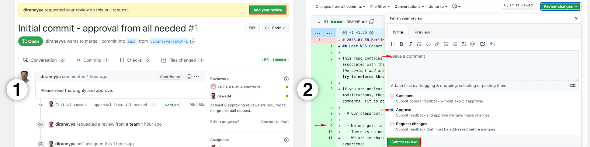

## Last WCS Cohort in Germany - Manifesto

This repo contains a set of values that I would like to establish through consensus in our cohort.

Please approve the <abbr title="Pull request">PR</abbr> associated with this commit as well as any future <abbr title="Pull requests">PRs</abbr> in this repo _only and only if:_
1. You fully understand the content (please do not hesitate to translate to your native tongue using [deepl](https://deepl.com))
2. You understand that we might sometimes reflect on certain happenings in the bootcamp by referring to this document 

One way to think of the manifesto, hence, is **as a social contract that we will try to implement through peer-governance throughout the bootcamp.**

<mark>We are all in this together! So if you are:</mark>

- unclear on some of the points below, what do they mean
- unclear on how some of the points below can work or be applied together
- would like to ask for clarifications
- would like to request modifications

... then please post your comments in the <abbr title="Pull request">PR</abbr> via the process of _code review_ or using _PR comments_ (it is possible in this way to comment on specific lines, add reactions, and start discussions, as shown in the image below):


```
>>> MANIFESTO STARTS HERE
```

# I. My classroom, my rules

- No one gets to decide what I learn here, beside me
- There is no one for whom I am learning here, beside me
- No one expects anything from me here, nor will I ever be blamed by anyone here
- I am in charge, I am in the driver seat of my learning, and hence in control of what I want to get out of this experience
- There is no one I am making proud here, beside me 
- There is no one I might be disappointing here, beside me
- There is no standard of what is good enough here from me, beside what I decide is good enough for me
- It is okay for me to be spontaneous here, and to have lazy days, when this is what I need
- When I am not happy with what I am doing, I learn to be more flexible with myself
- Even if I do not meet my own expectations, I do not blame myself
- Instead of putting myself down, I learn to adjust my expectations

# II. Our team, our rules

- As a number of people working together, we are in charge of what our project is all about, the methods we apply, and the technologies we want to use
- As a number of people working together, we know best what works for us
- I let the group of people I am working with know what I am seeking from our collaboration, and what meets the rules I set for myself (part I)
- I let the group of people I am working with know what I am not okay with in our collaboration, and what does not meet the rules I set for myself (part I)
- I work actively with those people to ensure that what we are doing meets my rules and theirs too
- In actively seeking what works for us as a group, I do not use implicit communication, rather, I express myself explicitly and clearly using words
- In actively seeking what works for us as a group, I invite others not to rely on implicit communication, but rather, to use explicit and clear communication instead
- As my collaboration with a group of people continues to evolve, I continue to express things as they come up, in an explicit and a clear way
- As my collaboration with a group of people continues to evolve, I continue to encourage others to express things that might come up, in an explicit and clear way
- I genuinely seek to accommodate (and not blame others) with all of their intricacies, and I trust that I will be accommodated (and not blamed) with all of mine

# III. I take responsibility and practice openness

- When I am frustrated, it is because of how I am coping
- Instead of dwelling on how I feel, I reflect on how I am coping with the situation
- I do not continue to cope in a certain way, if it is not making me feel good
- When I do not feel good, others also do not feel good
- When I am stuck or coping poorly, I feel responsible for unsticking myself
- To unstick myself, I actively reach out for help, and seek advice from people I trust
- Under no circumstance, I fall into the trap of [rationalising my feelings](https://en.wikipedia.org/wiki/Emotional_reasoning)
- Under no circumstance, I start blaming others for how I am feeling
- Under no circumstance, that I will shame or blame anyone for sharing their emotional state when this is done in a healthy way and while taking responsibility
- I speak my truth, while taking responsibility for how I am feeling, knowing that it is not easy to do so, and knowing that there might be consequences that I do not want to deal with
- I know that when I do not speak my truth, that others might not feel safe when interacting with me

# IV. I act out my better self

- I do not let my ego stand in the way of learning, I focus, instead, on logical conclusions and compelling arguments
- My pride or reputation is not what I need to demonstrate to others, rather, it is my empathy and merit
- I do not think in "good" or "bad" terms, rather, I try to see "pros" and "cons" to everything
- I do not think of things or people as "stupid", rather, I seek and promote structure and clarity
- I communicate what I see as "shortcomings" positively, and give others constructive and honest feedback

# V. I strive to make others feel safe
# V. I have faith that others prioritise my sense of saftey

_This is two sections in one, with two possible formulations for each one of the subsection paragraphs (named **for me** and **for others**)._

## Physical safety

1. **for me:** I know that others strive to ensure that my ...
2. **for others:** I strive to ensure that others' ...

> ... physical needs are met. I understand that everyone's need for food, shelter, warmth, a performant laptop/computer, and a peaceful place to study are all very important for all of us, and not taken for granted by anyone. We will hence not hesitate to speak up if some of our basic needs are not being met (temporarily or permanently), even when it is not immediately clear to us what can be done about it.

## Social safety

1. **for me:** I know that others strive to ensure that I am ...
2. **for others:** I strive to ensure that others are ...

> ... accepted regardless of their looks, race, gender, religious belief, habits, preferences, way of expression, personal style, or manners. What is most important for us is to be fully comfortable during class, which means being fully ourselves and trusting that others will tell us when our "way of being" triggers them, or collides with their sense of well-being and/or comfort.

> We know that it is normal that sometimes, some people might not feel comfortable with "us being ourselves". We know that when this happens, that we will together try to find a way to allow us all to be ourselves while making each other comfortable. It will not be a personal attack on anyone of us when this happens and we will naturally feel inclined to understand one another and to help them be as comfortable as possible without judgement.

## Emotional safety

1. **for me:** I know that others strive to ensure that I am ...
2. **for others:** I strive to ensure that others are ...

> ... putting a conscious effort into not emotionally maniopulating, bullying, lobbying with others, passing hidden messages, or using silent aggression. Instead, we have complete faith that everyone in the classroom will communicate openly and honestly with one another and that we will use effective and empathetic communication to achieve harmony, overcome conflict, and widen our perspectives.

## Logical safety

1. **for me:** I know that others strive to ensure that my ...
2. **for others:** I strive to ensure that others' ...


> ... learning personality, logical doubts, and inability to comprehend something is fully respected and is never out of place.

> And hence, we individually know that when we:
> - get distracted during class,
> - miss a few steps during a workshop,
> - look at the wrong slide,
> - not understand why the class is taking a certain direction

> ... that we are so invited 🥰 to raise our hand, un-mute ourselves, and express our confusion immediately. Doing so, we know that it:
> - is highly encouraged and pleasing to the facilitator to do this, 
> - serves a wonderful purpose for everyone in the classroom who might be thinking similarly,
> - is a positive action that will never be perceived as disruptive, or lead to behavioral accusations from anyone.

> Note that sometimes, some people in the classroom and/or the facilitator might think that it is better to attend to the point(s) raised at a later time. This might be due to time limitations, or due to pedagogical reasons.

> We know that when this happens that _it does not mean that our intervention was viewed negatively by anyone,_ and that we have done the right thing by voicing our doubts.

> In the case of promising to attend to the point(s) later but this not happening, we take it upon ourselves to remind the facilitator of our desire to have the point(s) addressed without feeling bad about it, or thinking that they are ignoring us, which is most certainly not the case.

```
<<< MANIFESTO ENDS HERE
```
